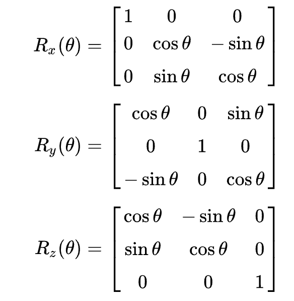

# 旋转甜甜圈（环面）教程

首先，这个代码是通过类似于点云的思想实现的。首先构造出环面的点云，之后对这些点进行旋转（围绕中心轴）和移动，从而确定每一个时刻的姿态。

得到3维空间的姿态后，再将3维模型在z轴进行透视投影。根据坐标z的远近关系确定ASCII字符的遮挡关系。

由于甜甜圈模型很难确定不同的面，如果使用的只是一个字符的话，展示效果会很差。所以还需要光照模型。

这里使用 `兰伯特光照模型`，即反射光线的强度与表面法线和光源方向之间的夹角余弦值成正比，夹角越大，收到的光线照射量就越少。

## 构造环面的三维模型

环面模型可以看作是一个小圆，围绕z轴旋转得来。

所以，我们定义：

1) 环面大圆半径为R（绕z-轴的圆的半径）， 对应的角度为 $\theta$
2) 环面的小圆半径为r（生成环面的圆的半径）， 对应的角度为 $\phi$

参数方程可以写为：

$$
x = (R + rcos\phi)cos\theta
$$
$$
y = (R + rcos\phi)sin\theta
$$
$$
z = rsin\phi
$$

根据参数方程，我们遍历 $\theta$ 和 $\phi$ 就可以构造环面的点云了。

## 旋转

三维的旋转矩阵如下：

因此，如果模型进行旋转，可以写为：

$$
[x, y, z] \quad @ \quad R_x(A) \quad @ \quad R_y(B) \quad @ \quad R_z(C)
$$

其中@ 表示矩阵乘法， [x, y, z] 表示坐标向量。

## 平移

在旋转操作之后，如果你想要把物体放到空间中的某个位置，就对旋转后的x, y, z坐标进行加减即可。

问：为何先旋转后平移？

    答：这样可以保证旋转的时候，物体是中心对称的。

## 投影

在z轴进行透视投影，投影的坐标计算为：

$$
x' = \frac{x}{z}
$$

$$
y' = \frac{y}{z}
$$

根据z的远近确定遮挡关系，z的值越小，距离相机越近。

## 光照模型

反射光线的强度与表面法线和光源方向之间的夹角余弦值成正比，夹角越大，收到的光线照射量就越少。

计算表面法线和光源方向的点积：

$$
I = max(0, N \cdot L)
$$

N: 表面法线向量（归一化后）
L: 光源方向向量（归一化后）
I：光照强度

### 环面模型法线向量的计算

曲面的某点的法向量可以通过两个切向量的叉积求得。这两个切向量是由曲面的参数方程分别对 $\theta$ 和 $\phi$求偏导得到的。

$$
\vec{N} = \frac{\partial \vec{P}}{\partial \theta} \times \frac{\partial \vec{P}}{\partial \phi}
$$

其中 $\vec{P}(\theta, \phi) = [x(\theta, \phi), y(\theta, \phi), z(\theta, \phi)]$ 表示环面上的点

1) 对 $\theta$ 求导：

$$
\frac{\partial \vec{P}}{\partial \theta} = [-(R + rcos\phi)sin\theta, (R + rcos\phi)cos\theta, 0]
$$

2) 对 $\phi$ 求导

$$
\frac{\partial \vec{P}}{\partial \phi} = [-rsin\phi cos\theta, -rsin\phi sin\theta, rcos\phi]
$$

#### 叉积计算法向量

给定两个向量：
$$
\vec{a} = (a_1, a_2, a_3), \quad \vec{b} = (b_1, b_2, b_3)
$$

它们的叉积定义为：
$$
\vec{a} \times \vec{b} = \begin{vmatrix}
\vec{i} & \vec{j} & \vec{k} \\
a_1 & a_2 & a_3 \\
b_1 & b_2 & b_3
\end{vmatrix}
$$

展开行列式时，每个分量会用到代数余子式：

$$
\vec{a} \times \vec{b} =
\vec{i} \begin{vmatrix} a_2 & a_3 \\ b_2 & b_3 \end{vmatrix} - \vec{j} \begin{vmatrix} a_1 & a_3 \\ b_1 & b_3 \end{vmatrix} + \vec{k} \begin{vmatrix} a_1 & a_2 \\ b_1 & b_2 \end{vmatrix}
$$

由此，我们开始计算 $N = \frac{\partial P}{\partial \theta} \times \frac{\partial P}{\partial \phi}$

可得：
$$
\vec{N}_x = \frac{\partial y}{\partial \theta} \frac{\partial z}{\partial \phi} - \frac{\partial z}{\partial \theta} \frac{\partial y}{\partial \phi}
$$
$$
\vec{N}_y = \frac{\partial z}{\partial \theta} \frac{\partial x}{\partial \phi} - \frac{\partial x}{\partial \theta} \frac{\partial z}{\partial \phi}
$$
$$
\vec{N}_z = \frac{\partial x}{\partial \theta} \frac{\partial y}{\partial \phi} - \frac{\partial y}{\partial \theta} \frac{\partial x}{\partial \phi}
$$

带入前面计算的偏导数后，得到：

$$
\vec{N} = 
\begin{bmatrix}
r \cos \phi (R + r \cos \phi) \cos \theta \\
r \cos \phi (R + r \cos \phi) \sin \theta \\
r \sin \phi (R + r \cos \phi)
\end{bmatrix}
$$

目前得到的法向量是没有归一化的， 为了简化表达。我们可以去除系数 $r (R + rcos\phi)$

以为这个系数是在每一个分量都存在的，最后归一化的时候还是会被消掉的。

所以，简化后的法向量为：

$$
\vec{N} = [\cos\theta \cos\phi, \sin\theta \cos\phi, \sin\phi]
$$